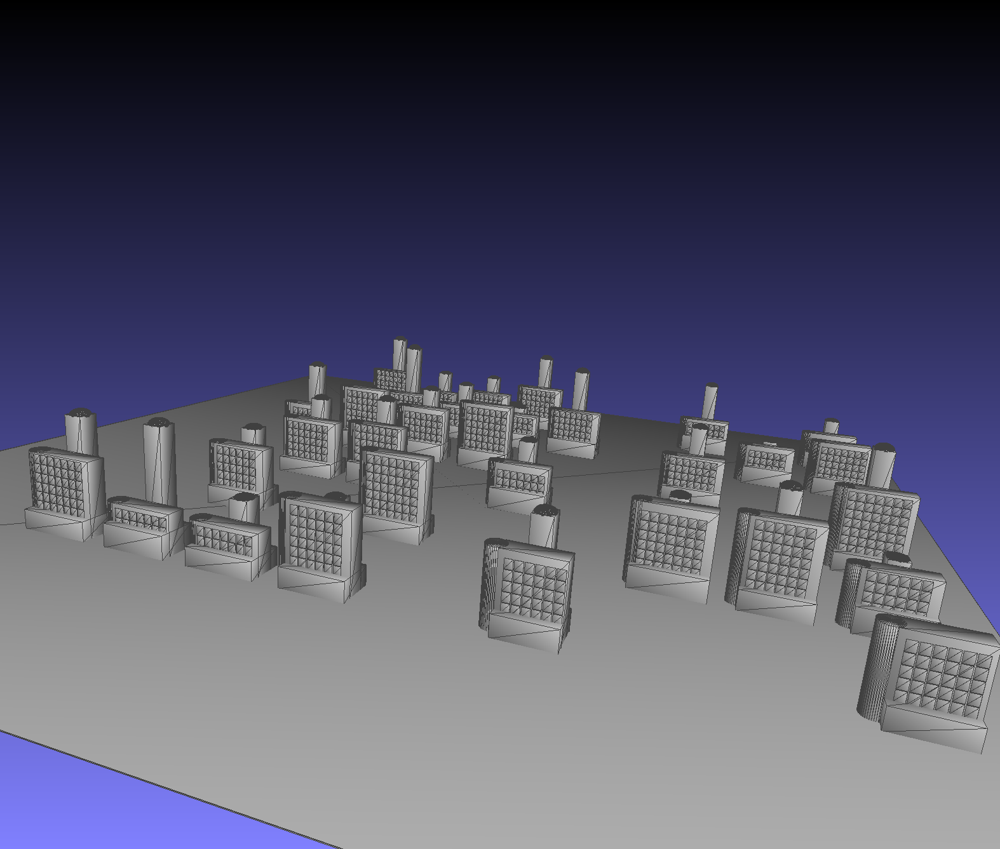
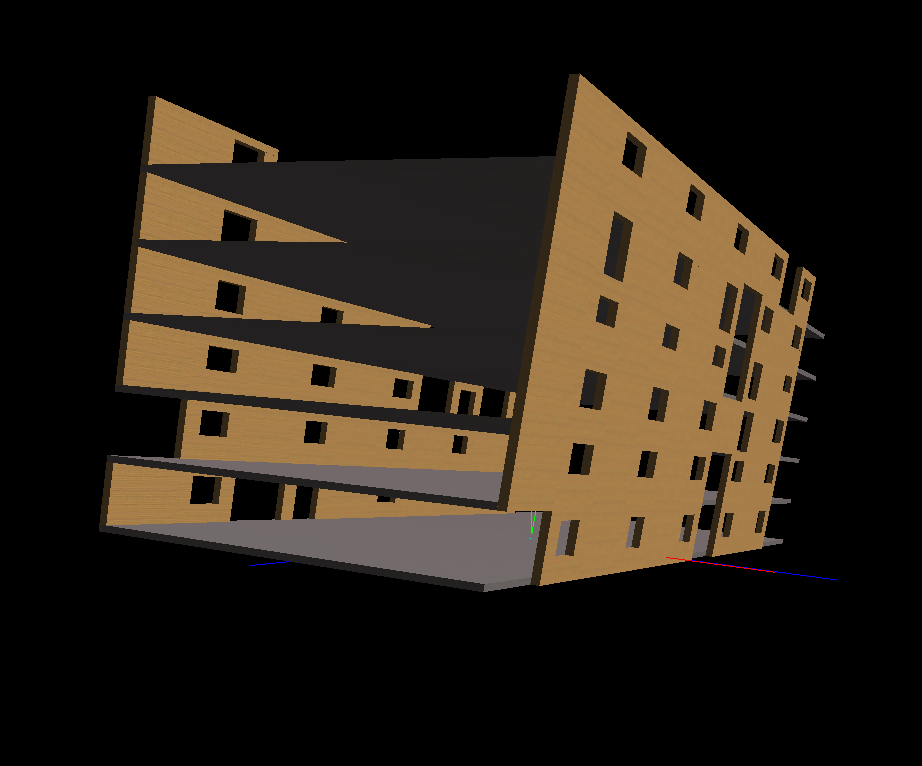

# ProGen3d
3d Procedural Generator

ProGen3d is a grammar that uses variables and symbolic math objects for calculations.
Based on https://github.com/santipaprika/procedural-buildings and https://github.com/mathSlib-dev/mathSlib .

Uses glm vector math, SoiL.h texture loading, Imath vector math, and Glut glu opengl.

### Variables

R variable_name ( min max )
---  Sets a variable

Example
```
X -> R Height ( 4.6 10.7 )
```

### Rules

Rule repeat_variable variable_randomise1 variable_randomise2 ... ; probability -> {Start} | {Repeat_Body} | {End} -> Alternate_Rule

Example
```
X -> R Height ( 4 7 ) R Width (10 13) Y

Y 8 Width Height ; 0.8 -> | S ( Width Height Width ) I ( Cube ) | T ( Width+3 0 0 ) -> Empty

Empty ->
```

### Scale

S ( variable variable variable )
S ( numeric numeric numeric )
S ( calculation calculation calculation )

or any combination of
```
S ( Width-1.5 Height/2 Width*2-4.3 ) 
```

### Translate
T ( variable variable variable )
T ( numeric numeric numeric )
T ( calculation calculation calculation )

or any combination of

```
T ( -1.5 Height/2 1.0/Width ) 
```


### Instantiate
I ( Cube )
I ( Sphere )
I ( Cylinder )

## Repeat Sections

Rule Repeat Section by Repeat_variable converted to integer floor and reroll random values for variables var_1,var_2,... to var_n the repeat section, starting with the start section and ending with the end section.
```
Rule Repeat_variable var_1 var_2 ... var_n  -> Start Section  | Repeat Section  | End Section 
```
Rule Repeat second section by variable Xlength converted to integer floor starting with the start section and ending with empty section.
```
WindowsXN Xlength ->  T ( Xlength/2.0-0.8 0 -1 )   | T ( -0.9 0 0 ) [  S ( 0.8 0.95 0.01 ) T ( 0.9 0 0 ) I ( Cube ) ] 
```

### Probability

The probability that Rule will be the first section set of sections or the second set of sections

```
Rule var_1 var_2 ... var_n ; p -> Sections -> Sections
```

The probability is 60% of drawing a building or empty.
```
AddBuilding ; 0.6 -> T ( 0 0 3 ) [ Center ]  T ( 0 0 -2 )  [ SectionX  ] [ SectionY ]
```


### Example
```
X -> R CenterHeight ( 4 10 ) R Xlength ( 6 8 ) R TowerHeight ( 6 14 ) R BaseHeight ( 2 3 ) Y


Y -> [ Floor ] T ( -50 0 -50 ) [  City ]
City ->  Street Street Street Street Street Street
Street ->  T ( 0 0 15 ) StreetBlocks 
Floor -> S ( 120 0.1 120 ) I ( Cube )
StreetBlocks ->  [ AddBuilding ] [ MoreBlocks ] 
MoreBlocks 8 ->    T ( 10 0 0 )  [ AddBuilding ]  


AddBuilding ; 0.6 -> T ( 0 0 3 ) [ Center ]  T ( 0 0 -2 )  [ SectionX  ]

Center 1 TowerHeight->   S ( 2 TowerHeight 2 ) I ( Cube )  Top 
Top ->  T ( 0 1 0 ) [ S ( 1 0.1 1 ) I ( Sphere ) ] T ( 0 -1 0 )  


Base 1 BaseHeight->   S ( Xlength  BaseHeight  4 )  I ( Cube )

BodyX ->  T ( 0 BaseHeight 0 ) S ( Xlength  CenterHeight  2 )  I ( Cube )  

Xend ->   S (  2  CenterHeight 2 ) T ( 1.75 0 0 ) I ( Cylinder ) 


SectionX CenterHeight CenterHeight Xlength ->   [ Base ] [ BodyX ] [ Xend ] | [ WindowsX ] T ( 0 1 0 ) | 
WindowsX Xlength ->  T ( Xlength/2.0-0.8 0 -1 )   | T ( -0.9 0 0 ) [  S ( 0.8 0.95 0.01 ) T ( 0.9 0 0 ) I ( Cube ) ] | 
```

<div align="center">
     
</div>


## Example 2 Textures


```

X -> R CenterHeight ( 4 10 ) R Xlength ( 6 8 ) R Ylength ( 4 6 ) R TowerHeight ( 6 14 ) R BaseHeight ( 2 3 ) Y


Y -> [ Floor ] T ( -50 0 -50 ) [  City ]
City ->  Street Street Street Street Street Street
Street ->  T ( 0 0 15 ) StreetBlocks 
Floor -> S ( 120 0.1 120 ) I ( Cube )
StreetBlocks ->  [ AddBuilding ] [ MoreBlocks ] 
MoreBlocks 8 ->    T ( 10 0 0 )  [ AddBuilding ]  


AddBuilding ; 0.6 -> T ( 0 0 3 ) [ Center ]  T ( 0 0 -2 )  [ SectionX  ] [ SectionY ]

Center 1 TowerHeight ->   S ( 2 TowerHeight 2 ) I ( Cube )  Top 
Top ->  T ( 0 1 0 ) [ S ( 1 0.1 1 ) I ( Sphere ) ] T ( 0 -1 0 )  

Base 1 BaseHeight ->   S ( Xlength  BaseHeight  Ylength )  I ( Cube )

BodyX ->  T ( 0 BaseHeight 0 ) S ( Xlength  CenterHeight  2 )  I ( Cube )  
BodyY ->  T ( 0 BaseHeight 0 ) S ( 2  CenterHeight  Ylength )  I ( Cube )  

Xend ->   S (  2  CenterHeight 2 ) T ( 1.75 0 0 ) I ( Cylinder ) 
Yend ->   S (  2  CenterHeight 2 ) T ( 0 0 1.75 ) I ( Cylinder ) 

SectionX CenterHeight CenterHeight Xlength ->   [ Base ] [ BodyX ] [ Xend ] | [ WindowsXN ] [ WindowsXS ] T ( 0 1 0 )  
WindowsXN Xlength ->  T ( Xlength/2.0-0.8 0 -1 )   | T ( -0.9 0 0 ) [  S ( 0.8 0.95 0.01 ) T ( 0.9 0 0 ) I ( Cube ) ]   
WindowsXS Xlength ->  T ( Xlength/2.0-0.8 0 1 )   | T ( -0.9 0 0 ) [  S ( 0.8 0.95 0.01 ) T ( 0.9 0 0 ) I ( Cube ) ]   

SectionY CenterHeight CenterHeight Ylength ->   [ BodyY ] [ Yend ] | [ WindowsYE ] [ WindowsYW ]  T ( 0 1 0 )  
WindowsYE Ylength ->  T ( -1 0 Ylength/2.0-0.8 )   | T ( 0 0 -0.9 ) [  S ( 0.01 0.95 0.8 ) T ( 0 0 0.9 ) I ( Cube ) ]  
WindowsYW Ylength ->  T ( 1 0 Ylength/2.0-0.8 )   | T ( 0 0 -0.9 ) [  S ( 0.01 0.95 0.8 ) T ( 0 0 0.9 ) I ( Cube ) ]
```


<div align="center">
     
</div>


```
X -> R xlen ( 4 6 ) R ylen ( 2 3 )  R WindowGapSides ( 0.2 0.3 ) R WindowGapTop ( 0.1 0.2 ) R WindowGapBottom ( 0.35 0.5 ) S ( 2.4 2.4 2.4 ) Y


Y  6 xlen ylen -> [ S ( 2*xlen 0.1 2*ylen ) I ( Cube 16 ) ] [ T ( -xlen 0 ylen ) GenX ]  [ T ( -xlen 0 -ylen ) GenX ] T ( 0 1 0 )


GenX xlen  WindowGapSides WindowGapTop WindowGapBottom -> | ChooseBlankWallX T ( 1 0 0 ) ChooseDoorWindowX T ( 1 0 0 )


ChooseBlankWallX ; 0.2 -> [ S ( 1 1 0.1 ) I ( CubeX 17 ) ] -> WindowDoorWindowX

ChooseDoorWindowX ; 0.8 -> WindowDoorSectionX -> WindowSectionX


WindowSectionX -> [ S ( 1 WindowGapBottom 0.1 ) I ( CubeX 17 ) ] [ T ( 0 1-WindowGapTop 0 ) S ( 1 WindowGapTop 0.1 ) I ( CubeX 17 ) ] [ T ( 0 WindowGapBottom 0 ) S ( WindowGapSides 1-WindowGapTop-WindowGapBottom 0.1 ) I ( CubeX 17 ) ] [ T ( 1-WindowGapSides WindowGapBottom 0 ) S ( WindowGapSides 1-WindowGapTop-WindowGapBottom 0.1 ) I ( CubeX 17 ) ]
WindowDoorSectionX -> [ S ( 1 WindowGapTop/2 0.1 ) I ( CubeX 17 ) ] [ T ( 0 1-WindowGapTop 0 ) S ( 1 WindowGapTop 0.1 ) I ( CubeX 17 ) ] [ T ( 0 WindowGapTop/2 0 ) S ( WindowGapSides 1-WindowGapTop-WindowGapTop/2 0.1 ) I ( CubeX 17 ) ] [ T ( 1-WindowGapSides WindowGapTop/2 0 ) S ( WindowGapSides 1-WindowGapTop-WindowGapTop/2 0.1 ) I ( CubeX 17 ) ]


```


<div align="center">
     
</div>
